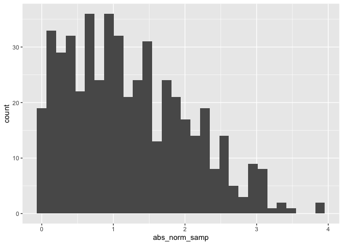

Simple document
================

``` r
library(tidyverse)

## load the packages will be used in the following chunks
## meesage FALSE = code chunk invisible
```

I'm an R Markdown document!

# Section 1

Here's a **code chunk** that samples from a *normal distribution*:

``` r
samp = rnorm(100)
length(samp)
```

    ## [1] 100

# Section 2

I can take the mean of the sample, too! The mean is -0.0173273.

``` r
# naming a code chuck
```

# Section 3

This code chunk imports the `tidyverse`, creates a data frame, and makes a histogram.

``` r
set.seed(2)

la_df =
  tibble(
    norm_samp = rnorm(500, mean = 1), 
    norm_samp_pos = norm_samp > 1, 
    abs_norm_samp = abs(norm_samp)
  )

ggplot(la_df, aes(x = abs_norm_samp)) + geom_histogram()
```

    ## `stat_bin()` using `bins = 30`. Pick better value with `binwidth`.



``` r
median_samp = median(pull(la_df, norm_samp))
```
